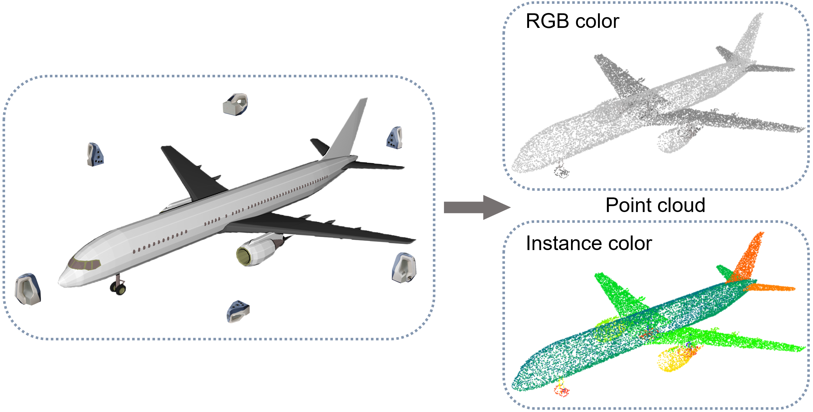

# Virtual 3D Scanner

This script is designed to simulate real world 3D scanners (Kinect, PrimeSense, etc.) in virtual environments. With this tool, you can easily create RGB-D or point cloud datasets from synthetic models, such datasets could be useful in the field related to computer graphics and computer vision.



Given a 3D mesh, a set of customizable virtual cameras scan the model from different views, the RGB-D images and corresponding point clouds are then produced. The dimension of the output point cloud is N×7, which contains xyz coordinate, rgb color, and an instance index (if available).

The script is running on [Blender](https://www.blender.org) (tested on version 2.80, 2.90), the render core is from [bpycv](https://github.com/DIYer22/bpycv).


## Installation

- Python environment of Blender

    Windows:
    ```
    cd <path to blender>/2.90/python/bin
    python -m ensurepip
    python -m pip install -U pip setuptools wheel
    ```

    Linux:
    ```
    cd <path to blender>/2.90/python/bin
    ./python3.7m -m ensurepip
    ./python3.7m -m pip install -U pip setuptools wheel
    ```

- bpycv and other dependencies

    Windows:
    
    ```
    # Download openexr for windows from https://www.lfd.uci.edu/~gohlke/pythonlibs/#openexr
    python -m pip install OpenEXR-1.3.2-cp37-cp37m-win_amd64.whl
    python -m pip install opencv-python bpycv
    ```

    Linux:
    ```
    ./python3.7m -m pip install opencv-python openexr bpycv
    ```

- h5py (optional), save point cloud compactly

    Windows:

    ```
    python -m pip install h5py
    ```

    Linux:
    ```
    ./python3.7m -m pip install h5py
    ```


## Usage

### Single model scanning
Two different setups are provided: `scan_single_around.py` and `scan_single_random.py`. The former creates fixed cameras from six directions around the object, pursuing a complete coverage of the object; the latter creates random cameras in each frame, which simulate the real scanning situation.

Run the following command:
```
blender -b -P scan_single_xxx.py <model_dir> <output_dir> <model_id> <save_rgbd_image> <save_pc_per_view> <save_pc_complete> <pc_per_view_size> <pc_complete_size>
```

Example:
`blender -b -P scan_single_around.py ./example_obj/model.obj ./output plane 1 1 1 2048 16384`

### Batch models scanning
Run the following command:
```
python scan_batch_shapenet.py <num_process> <dataset_dir> <output_dir> <save_rgbd_image> <save_pc_per_view> <save_pc_complete> <pc_per_view_size> <pc_complete_size>
```

Example:
`python scan_batch_shapenet.py 8 F:/datasets/ShapeNetCore.v2 ./output 1 1 1 2048 16384`

Note: This script is tested on ShapeNetCore.v2 dataset. For other datasets, please modify the directory structure in `scan_batch_shapenet.py` accordingly.

### Arguments
- Single scan
  - model_dir: the full path to the target model
  - model_id: the unique name of the target model

- Batch scan
  - num_process: number of processors to be used, adjust according to your computer hardware
  - dataset_dir: the full path to the dataset root folder

- Common
  - output_dir: the output directory
  - save_rgbd_image: whether to save RGB-D and instance image (0 for false, 1 for true, same for below)
  - save_pc_per_view: whether to save the partial point cloud of each single view
  - save_pc_complete: whether to save the complete point cloud by combining all views
  - pc_per_view_size: the points number of the single view point cloud
  - pc_complete_size: the points number of the complete point cloud


## Customize
- Camera intrinsic:

    Modify `INTRINSIC` matrix in `scan_single_around.py` or `scan_single_random.py`

- Camera numbers:

    Modify `cam_locations` list in `scan_single_around.py` or `NUM_FRAMES` value in `scan_single_random.py`

- Lights:

    Modify `setup_blender()` function in `scan_single_around.py` or `scan_single_random.py`
